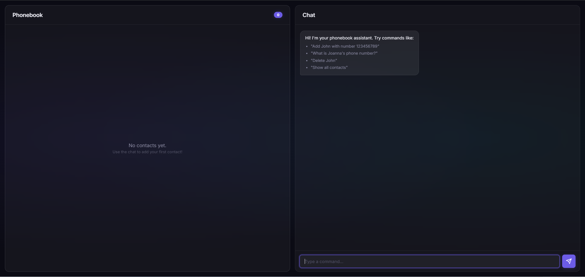
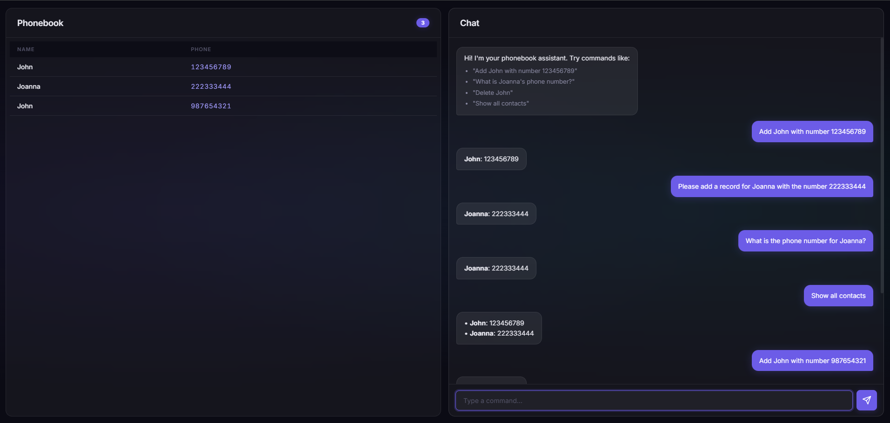
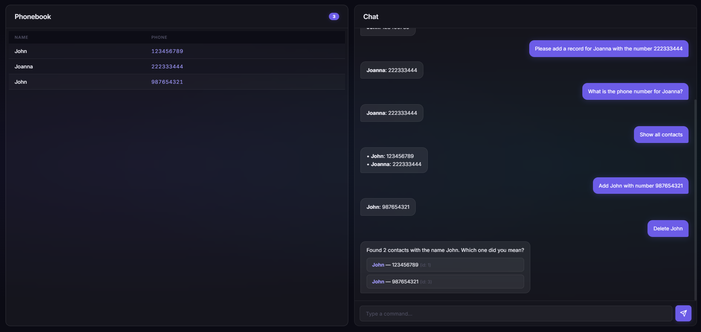
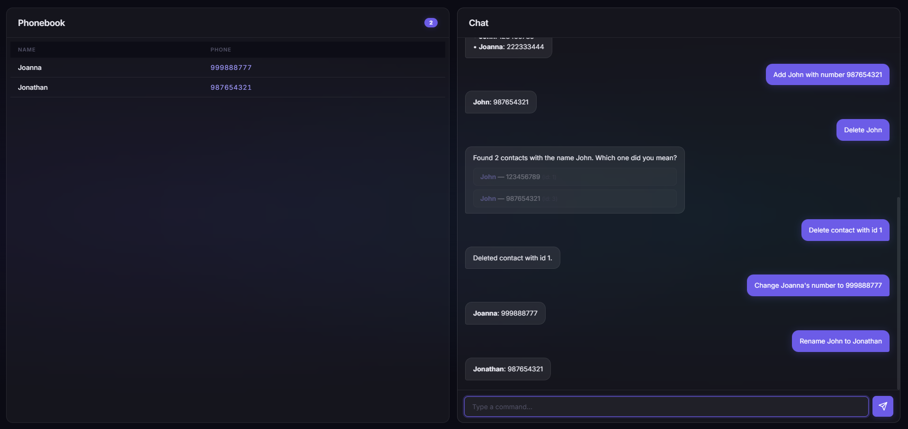

<div align="center">

# Phonebook — AI-Powered Contact Manager

**Manage your contacts using natural language, powered by Google Gemini AI.**

[](https://python.org)
[](https://fastapi.tiangolo.com)
[](https://ai.google.dev/)
[](https://sqlmodel.tiangolo.com)

---

*A smart phonebook web application that lets you add, search, edit, and delete contacts through conversational commands*

</div>

### App Overview


## Features

| Feature | Description |
|---|---|
| **Natural Language Interface** | Manage contacts by typing commands in plain English |
| **LLM-Powered Understanding** | Google Gemini interprets your intent and maps it to the right action |
| **Full CRUD Operations** | Create, read, update, and delete contacts seamlessly |
| **Smart Disambiguation** | When multiple contacts share the same name, the app asks you to pick the right one |
| **Real-Time Chat UI** | A sleek, dark-themed chat interface with loading animations and message bubbles |
| **Responsive Design** | Split-panel layout that adapts to any screen size |
| **Instant Sync** | Contact list updates in real time after every chat action |

---

## Tech Stack

### Backend
- **[FastAPI](https://fastapi.tiangolo.com/)** — High-performance async web framework for the REST API and chat endpoint
- **[SQLModel](https://sqlmodel.tiangolo.com/)** — ORM layer combining SQLAlchemy and Pydantic for type-safe database models
- **[Google GenAI (Gemini)](https://ai.google.dev/)** — LLM that interprets natural language prompts and maps them to CRUD function calls

### Frontend
- **Vanilla HTML / CSS / JavaScript** — No framework overhead, pure performance
- **[Inter (Google Fonts)](https://fonts.google.com/specimen/Inter)** — Modern, clean typography
- **CSS Custom Properties** — Fully themed dark UI with glassmorphism effects
- **Responsive CSS Grid** — Adaptive split-panel layout

---

## Architecture

```
┌─────────────────────────────────────────────────────────────────┐
│                        FRONTEND (Browser)                       │
│  ┌──────────────────────┐    ┌────────────────────────────────┐ │
│  │   Contact List Panel │    │         Chat Panel             │ │
│  │                      │    │                                │ │
│  │   ┌──────┬────────┐  │    │  User:  "Add John 123456789"   │ │
│  │   │ Name │ Phone  │  │    │  Bot:     Contact created!     │ │
│  │   ├──────┼────────┤  │    │                                │ │
│  │   │ John │ 123..  │  │    │  [Type a command...]  [Send]   │ │
│  │   └──────┴────────┘  │    └──────────┬─────────────────────┘ │
│  └──────────────────────┘               │                       │
└─────────────────────────────────────────┼───────────────────────┘
                                          │  POST /chat
                                          ▼
┌─────────────────────────────────────────────────────────────────┐
│                      BACKEND (FastAPI)                          │
│                                                                 │
│  ┌──────────┐    ┌──────────────┐    ┌───────────────────────┐  │
│  │ /chat    │───▶│  Google      │───▶│  Function Call       │  │
│  │ endpoint │    │  Gemini LLM  │    │  Router (main.py)     │  │
│  └──────────┘    └──────────────┘    └───────────┬───────────┘  │
│                                                  │              │
│                                      ┌───────────▼───────────┐  │
│                                      │   CRUD Operations     │  │
│                                      │   (crud.py)           │  │
│                                      └───────────┬───────────┘  │
│                                                  │              │
│                                      ┌───────────▼───────────┐  │
│                                      │   SQLite Database     │  │
│                                      │   (phonebook.db)      │  │
│                                      └───────────────────────┘  │
└─────────────────────────────────────────────────────────────────┘
```

---

## Application Flow

The application follows a well-defined pipeline to turn natural language into database operations:

```
  User Input          LLM Processing         Backend Logic          Database
  ──────────          ──────────────         ─────────────          ────────
      │                     │                      │                    │
      │  "Add John          │                      │                    │
      │   123456789"        │                      │                    │
      │────────────────────>|                      │                    │
      │               Analyze intent               │                    │
      │               with tool defs               │                    │
      │                     │                      │                    │
      │                     │  Function Call:      │                    │
      │                     │  create_contact      │                    │
      │                     │  {name, phone}       │                    │
      │                     │─────────────────────>│                    │
      │                     │                      │  INSERT INTO       │
      │                     │                      │  contacts          │
      │                     │                      │───────────────────>│
      │                     │                      │                    │
      │<───────────────────────────────────────────│  Result            │
      │  "Contact created!"                        │                    │
```

### Step-by-Step Breakdown

1. **User types a command** in the chat panel (e.g. *"Add John with number 123456789"*)
2. **Frontend sends a `POST /chat`** request with the prompt string as JSON
3. **FastAPI forwards the prompt to Google Gemini**, attaching a set of [function declarations](https://ai.google.dev/gemini-api/docs/function-calling) that describe the available CRUD operations
4. **Gemini analyzes the intent** and responds with a structured function call (e.g. `create_contact` with arguments `{name: "John", phone: "123456789"}`)
5. **FastAPI routes the function call** to the appropriate CRUD handler, executing the database operation via SQLModel
6. **The result is returned** to the frontend, which displays it as a chat message and refreshes the contact list

### Disambiguation Flow

When multiple contacts share the same name, the app handles it gracefully:

1. If the user says *"Delete John"* and there are **2 contacts named John**, the backend returns a disambiguation response
2. The chat shows **clickable buttons** for each matching contact (displaying name, phone, and ID)
3. The user clicks the correct contact, and a **follow-up request** is sent using the contact's unique ID

---

## Project Structure

```
phonebook-app/
├── backend/
│   ├── __init__.py          # Package marker
│   ├── main.py              # FastAPI app, routes, chat endpoint, disambiguation logic
│   ├── llm.py               # Google GenAI client & function tool declarations
│   ├── crud.py              # Database operations (create, read, update, delete)
│   ├── models.py            # SQLModel schemas (Contact, ContactCreate, ContactUpdate)
│   ├── database.py          # SQLModel engine setup & table initialization
│   └── .env                 # API key (not tracked in git)
├── frontend/
│   ├── index.html           # Main HTML page with split-panel layout
│   ├── app.js               # Chat logic, disambiguation UI, contact list rendering
│   └── style.css            # Dark theme, glassmorphism, animations
├── requirements.txt         # Python dependencies
├── .gitignore               # Git ignore rules
└── README.md                # This file
```

---

## Getting Started

### Prerequisites

- **Python 3.10+**
- **Google AI API Key** — Get one at [Google AI Studio](https://aistudio.google.com/apikey)

### 1. Clone the repository

```bash
git clone https://github.com/your-username/phonebook-app.git
cd phonebook-app
```

### 2. Create and activate a virtual environment

```bash
# Windows
python -m venv venv
venv\Scripts\activate

# macOS / Linux
python -m venv venv
source venv/bin/activate
```

### 3. Install dependencies

```bash
pip install -r requirements.txt
```

### 4. Configure the API key

Create a `.env` file inside the `backend/` directory:

```env
GOOGLE_API_KEY=your_google_api_key_here
```

### 5. Run the application

```bash
uvicorn backend.main:app --reload
```

The app will be available at **[http://localhost:8000](http://localhost:8000)**

> **Note:** The SQLModel database (`phonebook.db`) is automatically created on first launch.

---

## Usage Examples

Type any of these commands into the chat panel:

| Command | Action |
|---|---|
| `Add John with number 123456789` | Creates a new contact |
| `Please add a record for Joanna with the number 222333444` | Creates a new contact |
| `What is the phone number for Joanna?` | Retrieves a specific contact |
| `Show all contacts` | Lists every contact in the phonebook |
| `Delete John` | Removes a contact |
| `Change Joanna's number to 999888777` | Updates a contact's phone number |
| `Rename John to Jonathan` | Updates a contact's name |

---

### Chat with AI
#### Chat example of adding a new contact via natural language

#### Chat example of dealing with double records

#### Chat example of updating a contact


## API Endpoints

The app exposes both a **chat endpoint** and traditional **REST endpoints**:

### Chat (LLM-powered)

| Method | Endpoint | Description |
|---|---|---|
| `POST` | `/chat` | Process a natural language command |

**Request body:**
```json
{
  "prompt": "Add John with number 123456789"
}
```

### RESTful CRUD

| Method | Endpoint | Description |
|---|---|---|
| `GET` | `/contacts` | List all contacts |
| `POST` | `/contacts` | Create a new contact |
| `GET` | `/contacts/{id}` | Get a specific contact |
| `PUT` | `/contacts/{id}` | Update a contact |
| `DELETE` | `/contacts/{id}` | Delete a contact |

> **Interactive docs:** Visit [http://localhost:8000/docs](http://localhost:8000/docs) for the auto-generated Swagger UI.

---

## LLM Tool Declarations

The backend registers **8 function tools** with Gemini so it can understand a wide range of commands:

| Tool | Purpose |
|---|---|
| `create_contact` | Add a new contact (name + phone) |
| `get_contact` | Find a contact by name |
| `get_all_contacts` | Retrieve the full contact list |
| `get_contact_by_id` | Find a contact by unique ID |
| `delete_contact` | Remove a contact by name |
| `delete_contact_by_id` | Remove a contact by unique ID |
| `update_contact` | Edit a contact found by name |
| `update_contact_by_id` | Edit a contact found by unique ID |

The `*_by_id` variants are used internally for disambiguation follow-up actions.

---

## UI Design

The frontend features a **modern dark theme** with:

- **Dark glassmorphism panels** with frosted-glass backdrop blur
- **Purple accent palette** (`#6c5ce7`) with glowing shadows
- **Micro-animations** — message entrance effects, row slide-ins, loading dot bounce
- **Responsive layout** — adapts from side-by-side panels to stacked on mobile
- **Inter font** — clean, professional typography

---
